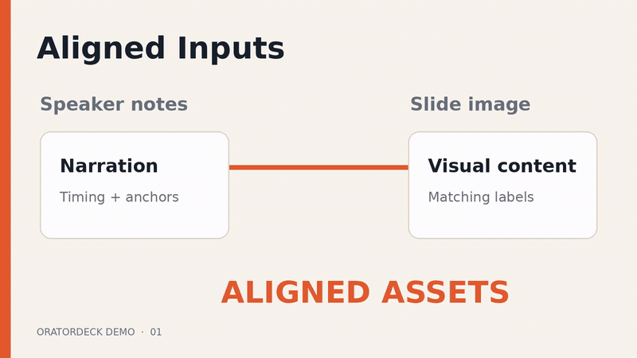
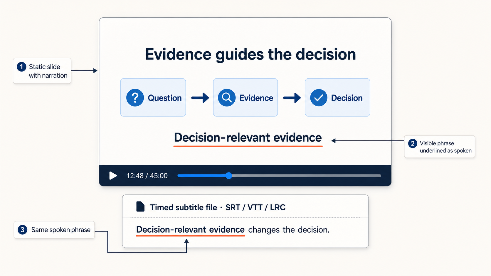
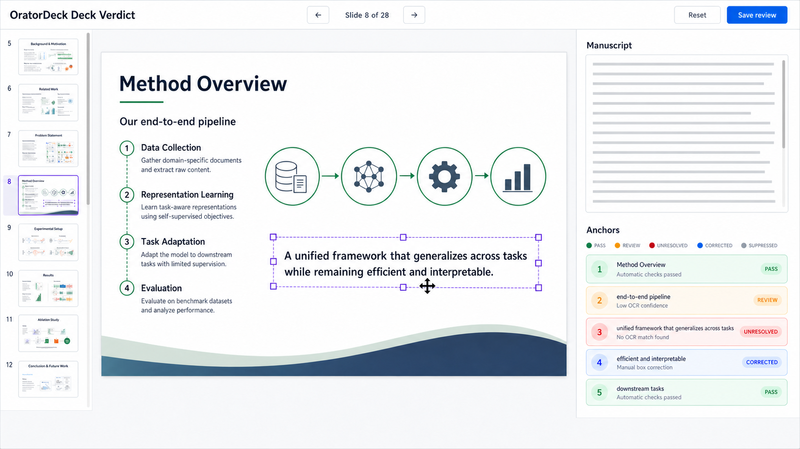

# OratorDeck

> Generate a narrated video with underlined visual anchors—plus separate,
> matching timed subtitles—so you can prepare a slide presentation faster.



Actual 28-second run from the public two-slide example:
[watch or download it with narration](https://github.com/yuminhhuang/OratorDeck/releases/download/v0.1.0/oratordeck-demo.mp4)
or [inspect its inputs](examples/demo).

[English](README.md) · [简体中文](README.zh-CN.md)

## What does OratorDeck do?

OratorDeck turns slide images and English speaker notes into a complete
narrated video. Each slide stays on screen while its narration plays, and a
visible anchor phrase is underlined when it is spoken. Matching subtitles are
provided as separate SRT, WebVTT, and LRC files.

The result is useful for rehearsing, reviewing, sharing, or publishing a
presentation without manually recording and editing every slide.



Each run also produces an anchor-position file that can help you add matching
appear/exit animations to the original editable presentation.

An optional **Deck Verdict** panel lets you flip through the presentation,
edit narration and bold anchors, and correct anchor boxes directly on each
slide image. The one-command workflow does not wait for this review: ignore the
panel, or inspect it while the GPU steps run and restart only when a correction
matters. It begins as a pre-TTS full review. Once subtitle-aware anchor timing
is ready, the same panel automatically switches to post-TTS box correction and
reveals a control for moving between the two phases.



OratorDeck has three independently usable, composable parts:

1. **Skill-assisted authoring:** the optional
   [`oratordeck`](skills/oratordeck) skill uses the **Prompt-as-Slide (PasS)
   protocol**—one authoritative, self-contained Markdown prompt per slide—to
   create aligned slide images and synchronized speaker notes.
2. **Standalone review:** the separately installable `oratordeck-verdict`
   panel reviews prepared images, narration, anchors, target times, and anchor
   boxes without an Agent or GPU.
3. **Media generation:** the repository workflow turns prepared images and
   speaker notes into audio, subtitles, anchor cues, and the final annotated
   video.

```text
PasS prompts → images + speaker notes ───────────────────→ narrated video
 optional Agent          │                                  GPU media runtime
                         └→ optional Deck Verdict
                              CPU/browser only
```

## Is OratorDeck right for you?

Use this quick guide:

| Your main goal | Best starting point |
| --- | --- |
| Produce a long-form English presentation from aligned slide images and speaker notes, with visible phrases underlined as they are spoken | **OratorDeck** |
| Create Prompt-as-Slide images and synchronized notes now, then generate media later or on another device | The optional **OratorDeck skill** |
| Review slide–narration consistency, bold anchors, timing goals, and anchor boxes without an Agent or GPU | The standalone **OratorDeck Verdict** package |
| Build and manually refine a native, editable PPTX through a GUI or an Agent | [Presenton](https://github.com/presenton/presenton) or [PPT Master](https://github.com/hugohe3/ppt-master) |
| Turn a research-paper PDF directly into a short narrated research video with burned-in captions and region-based visual cues | [ResearchStudio Paper2Video](https://github.com/microsoft/ResearchStudio/tree/main/ResearchStudio-Reel/skills/paper2video) |
| Generate a presentation deck without needing narration or an annotated video | [Presenton](https://github.com/presenton/presenton), [PPT Master](https://github.com/hugohe3/ppt-master), or [PPTAgent](https://github.com/icip-cas/PPTAgent) |

OratorDeck is a focused command-line workflow, not a general-purpose
PowerPoint editor or one-click paper summarizer. It is a strong fit when you
want precise control over long-form narration, slide timing, subtitle files,
and exact text anchors. The full local media workflow is currently designed
for Python 3.11 and an NVIDIA CUDA GPU; it does not produce an editable PPTX,
and its subtitles are separate files rather than burned into the video.

These tools are not mutually exclusive. You can author a deck elsewhere, then
export its slide images and adapt its notes to OratorDeck's input contract. A
device without a local GPU can use the authoring skill and/or Deck Verdict; a
GPU workstation without an Agent can use Deck Verdict and media generation.

## Option 1: Start with Prompt-as-Slide (PasS)

Under PasS, one self-contained Markdown prompt is the authoritative definition
of one slide: its purpose, exact visible wording, composition, and evidence
boundaries. The slide image and synchronized speaker notes are derived from
that shared source.

Create one PasS source per slide:

```text
resources/
├── slide-01_opening.md
├── slide-02_problem.md
├── slide-03_method.md
└── ...
```

If you only have an outline, the skill can help turn it into a coherent ordered
set of PasS sources.

Install the [`oratordeck`](skills/oratordeck) skill for Codex:

```bash
npx -y skills@latest add https://github.com/yuminhhuang/OratorDeck \
  --skill oratordeck \
  --agent codex \
  --global
```

You can also [inspect it on skills.sh](https://skills.sh/yuminhhuang/oratordeck/oratordeck)
or install it manually from the repository's `skills/oratordeck` directory.

Then ask Codex:

```text
Use $oratordeck to apply the Prompt-as-Slide (PasS) protocol to my presentation
and generate aligned slide images with synchronized English speaker notes.
```

The skill stops after preparing and auditing the prompts, images, and speaker
notes. It does not install or run the local media environment. You remain
responsible for facts, numbers, citations, and other source material.

If the media environment and GPU are already available, add:

```text
After the slide images and speaker notes pass their audit, continue outside the
skill by running scripts/generate-keynote-workflow.sh to produce the final
media.
```

## Option 2: Start from your own images and speaker notes

Neither the skill nor an Agent is required once you have prepared:

```text
resources/
├── SPEAKER_NOTES.md
└── generated-images/
    ├── slide-01_opening.png
    ├── slide-02_problem.png
    └── ...
```

You are responsible for keeping each image consistent with its narration.
Write one section per slide in `SPEAKER_NOTES.md`:

```markdown
## Slide 01 - Opening

**Target time:** 0:45

Welcome to the presentation. We will begin with the **central question** and
then build the evidence step by step.
```

Bold phrases are spoken normally. When the same phrase is clearly visible in
the matching slide image, OratorDeck tries to underline it as it is spoken.

Slide numbers must be contiguous and agree across the notes and images.
Supported image names include `slide-01.png`, `slide-01-opening.jpg`, and
`slide-01_opening.webp`.

## Install the local media environment

Skip this section if you only want the skill or standalone Deck Verdict.

```bash
git clone https://github.com/yuminhhuang/OratorDeck.git
cd OratorDeck

python3.11 -m venv .venv
./.venv/bin/python -m pip install -r requirements.txt

scripts/setup-voicebox.sh
```

Follow the command printed by `setup-voicebox.sh` to install the Voicebox
backend. Start it with:

```bash
ORATORDECK_TTS_GPU=0 scripts/run-voicebox.sh
```

Create an English Qwen CustomVoice profile in Voicebox before running the media
workflow. See the [installation guide](docs/installation.md) for complete
setup instructions and troubleshooting.

## Generate the presentation video

Edit `scripts/generate-keynote-workflow.sh` and set the run name, Voicebox
profile, GPU, and any timing preferences. Then run:

```bash
scripts/generate-keynote-workflow.sh
```

This single command generates the audio, subtitles, anchor cues, and final
video in a timestamped directory under `data/runs/`.

The optional Deck Verdict workbench opens in pre-TTS mode while generation
continues. You may ignore it, or review the deck while waiting for the GPU
steps:

- move through slides with the filmstrip, buttons, or Page Up/Page Down;
- edit the slide title, target time, narration, and `**bold anchors**`;
- move or resize an anchor box;
- create, restore, or suppress an anchor box;
- click **Save deck review** to keep your changes;
- click **Reset** to restore the panel's initial state.

The post-TTS phase is not shown until corrected subtitle timing and the final
anchor plan are available. The workbench then switches to it automatically.
This phase locks narration and anchors but lets you correct the boxes using the
actual timing diagnostics. You can switch between phases afterward. Switching
back to pre-TTS warns that semantic changes require rerunning audio, subtitles,
anchor planning, and video.

A pre-TTS save does not alter a run already in progress. If it matters, save,
interrupt, and rerun the workflow. A post-TTS box save can instead be applied
by rerendering the existing run without repeating TTS or subtitles.
At completion, the workflow repeats both exact commands in a prominent
**Deck Verdict — Next Steps After Save** block, so they do not get lost in the
generation log.

Use the editor command printed by the workflow whenever you need to reopen the
panel. Opening the HTML directly is read-only. Set
`open_pre_tts_verdict=false` in the workflow script if you do not want the
browser to open automatically.

## Install only Deck Verdict

Use this option to review prepared images and notes without installing the
skill, TTS stack, FFmpeg, or a GPU environment:

```bash
python3.11 -m venv .verdict-venv
.verdict-venv/bin/python -m pip install \
  "oratordeck-verdict @ git+https://github.com/yuminhhuang/OratorDeck.git"
```

Prepare, open, and apply a review:

```bash
oratordeck-verdict prepare SPEAKER_NOTES.md generated-images \
  --output deck-verdict.html \
  --review-json deck-review.json \
  --ocr-output deck-ocr.json

oratordeck-verdict edit deck-verdict.html deck-review.json

oratordeck-verdict apply \
  deck-review.json SPEAKER_NOTES.md generated-images \
  --ocr-results deck-ocr.json \
  --output-dir reviewed
```

Keep the `edit` command running while the panel is open. **Save deck review**
updates `deck-review.json`; **Reset** returns it to the panel's initial state.
The `reviewed/` directory can then be handed to another system or used with the
OratorDeck media workflow.

## Results and corrections

The files most users need are:

```text
data/runs/my-talk-YYYYMMDD-HHMMSS/
├── audio/my-talk.wav
├── subtitles/my-talk.srt
├── subtitles/my-talk.vtt
├── subtitles/my-talk.lrc
├── video/my-talk.mp4
├── video/anchor-animation-cues.json
├── video/anchor-verdict.html
└── workflow.log
```

The main deliverable is `video/my-talk.mp4`. The workflow also retains
per-slide media and diagnostic files in the same run directory.

`video/anchor-verdict.html` is the post-TTS phase payload for the same Deck
Verdict workbench. Narration and anchors are locked in that phase, but you can
move, resize, create, restore, or suppress underline boxes. The phase remains
invisible until this payload is complete, then the open workbench selects it
automatically.

Reopen both phases in one workbench with:

```bash
.venv/bin/python -m oratordeck_verdict edit \
  resources/.oratordeck/deck-verdict.html \
  resources/.oratordeck/deck-review.json \
  --post-html data/runs/my-talk-YYYYMMDD-HHMMSS/video/anchor-verdict.html \
  --post-state data/runs/my-talk-YYYYMMDD-HHMMSS/video/anchor-overrides.json
```

After saving box corrections, rerender the existing run without repeating TTS
or subtitle generation:

```bash
.venv/bin/python scripts/generate-keynote-video.py \
  --rerender-from-report data/runs/my-talk-YYYYMMDD-HHMMSS/video/anchor-video-report.json \
  --anchor-overrides data/runs/my-talk-YYYYMMDD-HHMMSS/video/anchor-overrides.json \
  --overwrite
```

To change narration, target times, or bold anchors, switch the workbench back
to pre-TTS, save, and start a new media run.

## Current limitations

- The local media workflow currently targets English narration.
- Slide backgrounds are static images.
- Subtitles are separate files rather than burned into the MP4.
- Anchor text must be clearly visible in the slide image to be underlined.
- Deck Verdict cannot edit slide pixels or layout.
- Target durations are goals; the selected voice may speak faster or slower.
- Generated slides, narration, subtitles, and anchors should be reviewed before
  publication.

## More documentation

- [Installation and environment setup](docs/installation.md)
- [Technical architecture, data contracts, and repository internals](docs/architecture.md#english)
- [Third-party notices](THIRD_PARTY_NOTICES.md)

## Responsible use

Use only voices and source material that you own or have permission to use.
OratorDeck is intended to assist authorship, not to impersonate people or hide
the origin of synthetic media.

## Acknowledgements

OratorDeck is built on the work of
[Voicebox](https://github.com/jamiepine/voicebox),
[Qwen3-TTS](https://github.com/QwenLM/Qwen3-TTS),
[OpenAI Whisper](https://github.com/openai/whisper),
[Hugging Face Transformers](https://github.com/huggingface/transformers),
[RapidOCR](https://github.com/RapidAI/RapidOCR),
[FFmpeg](https://ffmpeg.org/),
[imageio-ffmpeg](https://github.com/imageio/imageio-ffmpeg),
[PyTorch](https://github.com/pytorch/pytorch),
[FlashAttention](https://github.com/Dao-AILab/flash-attention),
[NumPy](https://github.com/numpy/numpy),
[python-soundfile](https://github.com/bastibe/python-soundfile), and
[Pillow](https://github.com/python-pillow/Pillow). Thank you to their
maintainers and contributors.

OratorDeck is an independent project and is not endorsed by or affiliated with
these upstream projects.

## License

OratorDeck is released under the [MIT License](LICENSE). Runtime libraries and
model weights retain their own licenses and terms.
